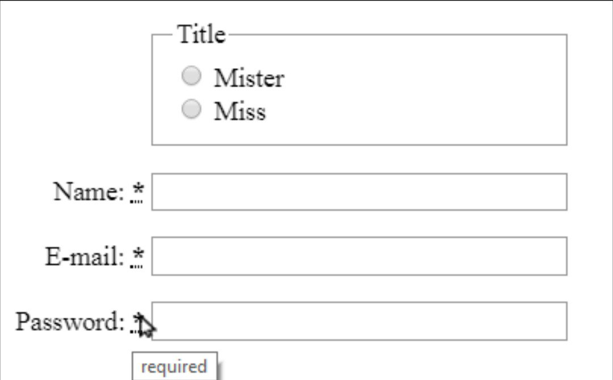
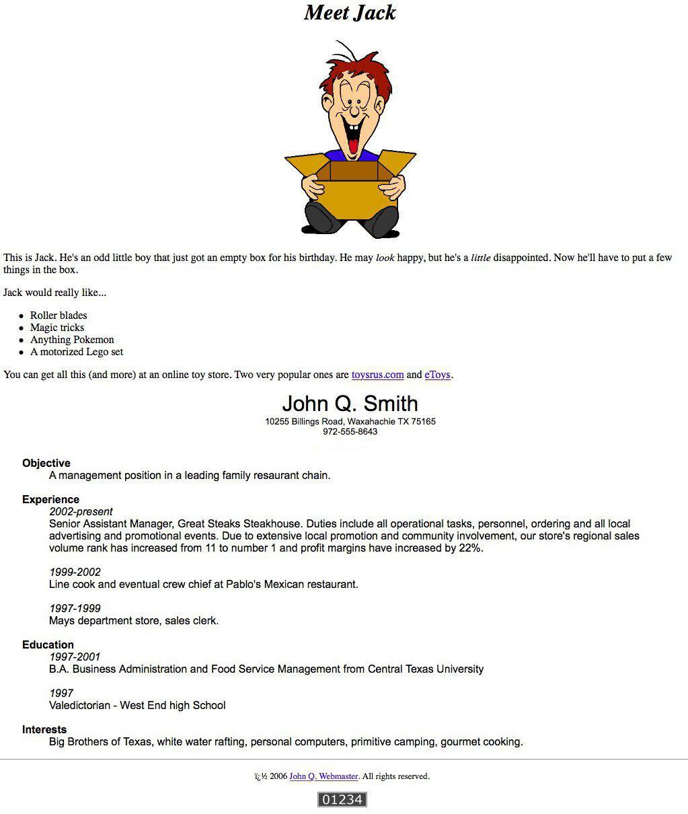
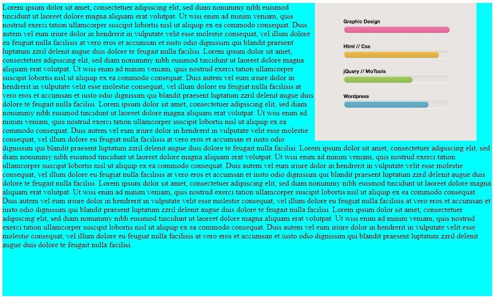

### **PURE HTML**
Hello this is about first project and practice for basic of the 
web development and doing practice in HTML.
the project appending to this page and showing what I should be done 
the context of the project is :

1)This is a simple form for working with form label in html:  

2)This is about working with time,section,div,... tag in html(this is used mostly tag in html):  

3)This is final and most good for typefasting and using progress tag :   

**_author:Kianoush NasrAzadani(KNA)_**
